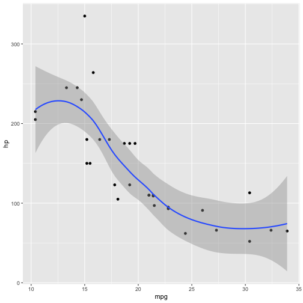
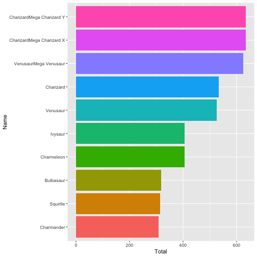
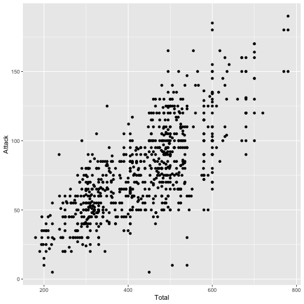
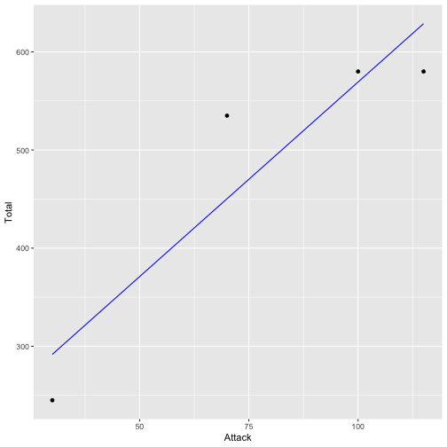

Ten fun functions with Tidyverse
========================================================
author: Daniel Jiménez M.
date: 
autosize: true

Some considerations 
========================================================
This presentation is based on [David Robinson](https://resources.rstudio.com/rstudio-conf-2018/teach-the-tidyverse-to-beginners-david-robinson) conference -**Teach the Tidyverse to beginners**- and some practices of my experience.

What is Tidyverse?
========================================================


Tidyverse
========================================================


```r
install.packages("tidyverse")
```


Tidyverse
========================================================

>The tidyverse is an opinionated collection of R packages designed for data science. All packages share an underlying design philosophy, grammar, and data structures.

(https://www.tidyverse.org/)


Tidyverse
========================================================
Tidyverse contains this packages

* ggplot
* dplyr
* tydir
* reader
* tibble
* purr
* more ...

Tidyverse Philosophy
========================================================


Tidyverse Tools
========================================================
* Import Data
* Etl
* tidy data
* Create function and program
* Transform data
* Visualize Data
* Modelling 
* Communicate your outputs

Tidyverse First Function: Describe your data (structure)
========================================================


```r
library(tidyverse)
data(mtcars)
mtcars%>%
  glimpse()
```

```
Rows: 32
Columns: 11
$ mpg  <dbl> 21.0, 21.0, 22.8, 21.4, 18.7, 18.1, 14.3, 24.4, 22.8, 19.2, 17.8…
$ cyl  <dbl> 6, 6, 4, 6, 8, 6, 8, 4, 4, 6, 6, 8, 8, 8, 8, 8, 8, 4, 4, 4, 4, 8…
$ disp <dbl> 160.0, 160.0, 108.0, 258.0, 360.0, 225.0, 360.0, 146.7, 140.8, 1…
$ hp   <dbl> 110, 110, 93, 110, 175, 105, 245, 62, 95, 123, 123, 180, 180, 18…
$ drat <dbl> 3.90, 3.90, 3.85, 3.08, 3.15, 2.76, 3.21, 3.69, 3.92, 3.92, 3.92…
$ wt   <dbl> 2.620, 2.875, 2.320, 3.215, 3.440, 3.460, 3.570, 3.190, 3.150, 3…
$ qsec <dbl> 16.46, 17.02, 18.61, 19.44, 17.02, 20.22, 15.84, 20.00, 22.90, 1…
$ vs   <dbl> 0, 0, 1, 1, 0, 1, 0, 1, 1, 1, 1, 0, 0, 0, 0, 0, 0, 1, 1, 1, 1, 0…
$ am   <dbl> 1, 1, 1, 0, 0, 0, 0, 0, 0, 0, 0, 0, 0, 0, 0, 0, 0, 1, 1, 1, 0, 0…
$ gear <dbl> 4, 4, 4, 3, 3, 3, 3, 4, 4, 4, 4, 3, 3, 3, 3, 3, 3, 4, 4, 4, 3, 3…
$ carb <dbl> 4, 4, 1, 1, 2, 1, 4, 2, 2, 4, 4, 3, 3, 3, 4, 4, 4, 1, 2, 1, 1, 2…
```

Tidyverse Second Function: create graphs for your data
========================================================


```r
mtcars%>%
  ggplot(aes(mpg,hp))+
  geom_point()+
  geom_smooth(method='auto')
```




Tidyverse Third Function: Summary your data
========================================================


```r
iris%>%
  group_by(Species)%>%
  summarize(mean_petal_length=mean(Petal.Length))%>%
  arrange(desc(mean_petal_length))
```

```
# A tibble: 3 x 2
  Species    mean_petal_length
  <fct>                  <dbl>
1 virginica               5.55
2 versicolor              4.26
3 setosa                  1.46
```

Tidyverse Fourth Function: Create Models
========================================================


```r
iris%>%
  group_by(Species)%>%
  summarize(loess_model=list(loess(Petal.Length~Sepal.Length+Sepal.Width+Petal.Width)))
```

```
# A tibble: 3 x 2
  Species    loess_model
  <fct>      <list>     
1 setosa     <loess>    
2 versicolor <loess>    
3 virginica  <loess>    
```

Tidyverse Fourth Function: Create Models
========================================================


```r
library(broom)
iris%>%
  group_by(Species)%>%
  summarize(Lineal_model=list(lm(Petal.Length~Sepal.Length+Sepal.Width+Petal.Width)))%>%
  mutate(tidies=map(Lineal_model,tidy,conf.int = TRUE))
```

```
# A tibble: 3 x 3
  Species    Lineal_model tidies          
  <fct>      <list>       <list>          
1 setosa     <lm>         <tibble [4 × 7]>
2 versicolor <lm>         <tibble [4 × 7]>
3 virginica  <lm>         <tibble [4 × 7]>
```

Tidyverse Fourth Function: Create Models
========================================================


```r
iris%>%
  group_by(Species)%>%
  summarize(Lineal_model=list(lm(Petal.Length~Sepal.Length+Sepal.Width+Petal.Width)))%>%
  mutate(tidies=map(Lineal_model,tidy,conf.int = TRUE))%>%
  unnest(tidies)
```

```
# A tibble: 12 x 9
   Species Lineal_model term  estimate std.error statistic  p.value conf.low
   <fct>   <list>       <chr>    <dbl>     <dbl>     <dbl>    <dbl>    <dbl>
 1 setosa  <lm>         (Int…   0.865     0.343      2.52  1.52e- 2  0.174  
 2 setosa  <lm>         Sepa…   0.116     0.102      1.14  2.59e- 1 -0.0885 
 3 setosa  <lm>         Sepa…  -0.0287    0.0933    -0.307 7.60e- 1 -0.217  
 4 setosa  <lm>         Peta…   0.463     0.234      1.98  5.42e- 2 -0.00869
 5 versic… <lm>         (Int…   0.165     0.400      0.412 6.82e- 1 -0.641  
 6 versic… <lm>         Sepa…   0.436     0.0794     5.49  1.67e- 6  0.276  
 7 versic… <lm>         Sepa…  -0.107     0.146     -0.731 4.69e- 1 -0.401  
 8 versic… <lm>         Peta…   1.36      0.236      5.77  6.37e- 7  0.886  
 9 virgin… <lm>         (Int…   0.465     0.477      0.975 3.35e- 1 -0.495  
10 virgin… <lm>         Sepa…   0.743     0.0713    10.4   1.07e-13  0.599  
11 virgin… <lm>         Sepa…  -0.0823    0.160     -0.514 6.10e- 1 -0.404  
12 virgin… <lm>         Peta…   0.216     0.174      1.24  2.22e- 1 -0.135  
# … with 1 more variable: conf.high <dbl>
```


Tidyverse Fourth Function: Create Models
========================================================


```r
iris%>%
  group_by(Species)%>%
  summarize(Lineal_model=list(lm(Petal.Length~Sepal.Length+Sepal.Width+Petal.Width)))%>%
  mutate(tidies=map(Lineal_model,tidy,conf.int = TRUE))%>%
  mutate(predictions=map(Lineal_model,predict))
```

```
# A tibble: 3 x 4
  Species    Lineal_model tidies           predictions
  <fct>      <list>       <list>           <list>     
1 setosa     <lm>         <tibble [4 × 7]> <dbl [50]> 
2 versicolor <lm>         <tibble [4 × 7]> <dbl [50]> 
3 virginica  <lm>         <tibble [4 × 7]> <dbl [50]> 
```


Tidyverse Fourth Function: Create Models
========================================================

```r
iris%>%
  group_by(Species)%>%
  summarize(Lineal_model=list(lm(Petal.Length~Sepal.Length+Sepal.Width+Petal.Width)))%>%
  mutate(tidies=map(Lineal_model,tidy,conf.int = TRUE))%>%
  mutate(predictions=map(Lineal_model,predict))%>%
  unnest(predictions)
```

```
# A tibble: 150 x 4
   Species Lineal_model tidies           predictions
   <fct>   <list>       <list>                 <dbl>
 1 setosa  <lm>         <tibble [4 × 7]>        1.45
 2 setosa  <lm>         <tibble [4 × 7]>        1.44
 3 setosa  <lm>         <tibble [4 × 7]>        1.41
 4 setosa  <lm>         <tibble [4 × 7]>        1.40
 5 setosa  <lm>         <tibble [4 × 7]>        1.44
 6 setosa  <lm>         <tibble [4 × 7]>        1.57
 7 setosa  <lm>         <tibble [4 × 7]>        1.44
 8 setosa  <lm>         <tibble [4 × 7]>        1.44
 9 setosa  <lm>         <tibble [4 × 7]>        1.39
10 setosa  <lm>         <tibble [4 × 7]>        1.39
# … with 140 more rows
```


Tidyverse Fifth Function: Reorder and rename
========================================================


```r
pokemon<-read.csv('https://gist.githubusercontent.com/armgilles/194bcff35001e7eb53a2a8b441e8b2c6/raw/92200bc0a673d5ce2110aaad4544ed6c4010f687/pokemon.csv')

pokemon%>%
  head()
```

```
  X.                  Name Type.1 Type.2 Total HP Attack Defense Sp..Atk
1  1             Bulbasaur  Grass Poison   318 45     49      49      65
2  2               Ivysaur  Grass Poison   405 60     62      63      80
3  3              Venusaur  Grass Poison   525 80     82      83     100
4  3 VenusaurMega Venusaur  Grass Poison   625 80    100     123     122
5  4            Charmander   Fire          309 39     52      43      60
6  5            Charmeleon   Fire          405 58     64      58      80
  Sp..Def Speed Generation Legendary
1      65    45          1     False
2      80    60          1     False
3     100    80          1     False
4     120    80          1     False
5      50    65          1     False
6      65    80          1     False
```


Tidyverse Fifth Function: Reorder and rename
========================================================


```r
pokemon%>%
  mutate(Name=fct_reorder(Name, Total))%>%
  distinct(Name,.keep_all=TRUE)%>%
  head(10)%>%
  ggplot(aes(Name,Total,fill=Name))+
  geom_col(show.legend=FALSE)+
  coord_flip()
```




Tidyverse Sixth Function: Coefficients of mutiple models
========================================================


```r
pokemon%>%
  ggplot(aes(Total,Attack))+
  geom_point()
```




Tidyverse Sixth Function: Coefficients of mutiple models
========================================================


```r
pokemon%>%
  filter(!is.na(Type.1))%>%
  group_by(Type.1)%>%
  summarize(lm_model=list(lm(Total~Attack)))%>%
  mutate(coef=map(lm_model,tidy,conf.int=TRUE))%>%
  unnest(coef)
```

```
# A tibble: 36 x 9
   Type.1 lm_model term  estimate std.error statistic  p.value conf.low
   <fct>  <list>   <chr>    <dbl>     <dbl>     <dbl>    <dbl>    <dbl>
 1 Bug    <lm>     (Int…   206.      20.1       10.3  1.97e-15   166.  
 2 Bug    <lm>     Atta…     2.43     0.251      9.69 2.26e-14     1.93
 3 Dark   <lm>     (Int…   185.      51.9        3.57 1.27e- 3    79.1 
 4 Dark   <lm>     Atta…     2.95     0.564      5.22 1.37e- 5     1.79
 5 Dragon <lm>     (Int…   174.      58.4        2.97 5.80e- 3    54.3 
 6 Dragon <lm>     Atta…     3.36     0.500      6.73 1.85e- 7     2.34
 7 Elect… <lm>     (Int…   239.      37.5        6.39 1.09e- 7   164.  
 8 Elect… <lm>     Atta…     2.95     0.513      5.75 9.08e- 7     1.92
 9 Fairy  <lm>     (Int…   235.      52.4        4.48 4.38e- 4   123.  
10 Fairy  <lm>     Atta…     2.90     0.771      3.76 1.91e- 3     1.25
# … with 26 more rows, and 1 more variable: conf.high <dbl>
```

Tidyverse Sixth Function: Coefficients of mutiple models
========================================================


```r
pokemon%>%
  filter(!is.na(Type.1))%>%
  group_by(Type.1)%>%
  summarize(lm_model=list(lm(Total~Attack)))%>%
  mutate(coef=map(lm_model,tidy,conf.int=TRUE))%>%
  unnest(coef)
```

```
# A tibble: 36 x 9
   Type.1 lm_model term  estimate std.error statistic  p.value conf.low
   <fct>  <list>   <chr>    <dbl>     <dbl>     <dbl>    <dbl>    <dbl>
 1 Bug    <lm>     (Int…   206.      20.1       10.3  1.97e-15   166.  
 2 Bug    <lm>     Atta…     2.43     0.251      9.69 2.26e-14     1.93
 3 Dark   <lm>     (Int…   185.      51.9        3.57 1.27e- 3    79.1 
 4 Dark   <lm>     Atta…     2.95     0.564      5.22 1.37e- 5     1.79
 5 Dragon <lm>     (Int…   174.      58.4        2.97 5.80e- 3    54.3 
 6 Dragon <lm>     Atta…     3.36     0.500      6.73 1.85e- 7     2.34
 7 Elect… <lm>     (Int…   239.      37.5        6.39 1.09e- 7   164.  
 8 Elect… <lm>     Atta…     2.95     0.513      5.75 9.08e- 7     1.92
 9 Fairy  <lm>     (Int…   235.      52.4        4.48 4.38e- 4   123.  
10 Fairy  <lm>     Atta…     2.90     0.771      3.76 1.91e- 3     1.25
# … with 26 more rows, and 1 more variable: conf.high <dbl>
```


Tidyverse Sixth Function: Coefficients of mutiple models
========================================================


```r
pokemon_stats<-pokemon%>%
  filter(!is.na(Type.1))%>%
  group_by(Type.1)%>%
  summarize(lm_model=list(lm(Total~Attack)))%>%
  mutate(coef=map(lm_model,glance,conf.int=TRUE))%>%
  unnest(coef)

pokemon_stats%>%
  top_n(n=5, wt=r.squared)
```

```
# A tibble: 5 x 13
  Type.1 lm_model r.squared adj.r.squared sigma statistic  p.value    df logLik
  <fct>  <list>       <dbl>         <dbl> <dbl>     <dbl>    <dbl> <int>  <dbl>
1 Fight… <lm>         0.753         0.743  51.9      76.2 4.63e- 9     2 -144. 
2 Flying <lm>         0.848         0.773  77.0      11.2 7.89e- 2     2  -21.7
3 Ground <lm>         0.718         0.709  66.9      76.4 9.60e-10     2 -179. 
4 Poison <lm>         0.778         0.769  44.4      90.9 5.69e-10     2 -145. 
5 Psych… <lm>         0.668         0.662  80.9     111.  8.99e-15     2 -330. 
# … with 4 more variables: AIC <dbl>, BIC <dbl>, deviance <dbl>,
#   df.residual <int>
```

Tidyverse Sixth Function: Coefficients of mutiple models
========================================================


```r
pokemon_stats%>%
  top_n(n=5, wt=-r.squared)
```

```
# A tibble: 5 x 13
  Type.1 lm_model r.squared adj.r.squared sigma statistic p.value    df logLik
  <fct>  <list>       <dbl>         <dbl> <dbl>     <dbl>   <dbl> <int>  <dbl>
1 Dark   <lm>         0.485         0.467  79.7      27.3 1.37e-5     2  -179.
2 Elect… <lm>         0.440         0.427  80.0      33.1 9.08e-7     2  -254.
3 Ghost  <lm>         0.402         0.382  86.5      20.2 9.75e-5     2  -187.
4 Ice    <lm>         0.368         0.340  88.0      12.8 1.66e-3     2  -140.
5 Rock   <lm>         0.384         0.369  85.8      26.2 7.28e-6     2  -257.
# … with 4 more variables: AIC <dbl>, BIC <dbl>, deviance <dbl>,
#   df.residual <int>
```
Tidyverse Sixth Function: Coefficients of mutiple models
========================================================


```r
pokemon_aug<-pokemon%>%
  filter(!is.na(Type.1))%>%
  group_by(Type.1)%>%
  summarize(lm_model=list(lm(Total~Attack)))%>%
  mutate(coef=map(lm_model,augment))%>%
  unnest(coef)
```


Tidyverse Sixth Function: Coefficients of mutiple models
========================================================


```r
pokemon_aug%>%
  filter(Type.1=='Flying')%>%
  ggplot(aes(Attack,Total))+
  geom_point()+
  geom_line(aes(y=.fitted),color='blue')
```




Tidyverse seventh Function: Evaluate yours models
========================================================


```r
library(tidymodels)
iris_split <- initial_split(iris, prop = 0.75,strata=Species)
training_data <- training(iris_split)
testing_data <- testing(iris_split)
```


Tidyverse seventh Function: Evaluate yours models
========================================================


```r
library(rsample)
cv_split= vfold_cv(training_data, v=2)
cv_split
```

```
#  2-fold cross-validation 
# A tibble: 2 x 2
  splits          id   
  <named list>    <chr>
1 <split [57/57]> Fold1
2 <split [57/57]> Fold2
```

Tidyverse seventh Function: Evaluate yours models
========================================================


```r
cv_split%>%
  mutate(train=map(splits,~training(.x)),
         validate=map(splits,~testing(.x)))
```

```
#  2-fold cross-validation 
# A tibble: 2 x 4
  splits          id    train             validate         
* <named list>    <chr> <named list>      <named list>     
1 <split [57/57]> Fold1 <df[,5] [57 × 5]> <df[,5] [57 × 5]>
2 <split [57/57]> Fold2 <df[,5] [57 × 5]> <df[,5] [57 × 5]>
```


Tidyverse seventh Function: Evaluate yours models
========================================================


```r
cv_split%>%
  mutate(train=map(splits,~training(.x)),
         validate=map(splits,~testing(.x)))->cv
```


```r
cv_lm<-cv%>%
  mutate(models=map(train,~lm(Sepal.Length~Petal.Length,data=.x)))
```


Tidyverse seventh Function: Evaluate yours models
========================================================


```r
cv_prp_lm<-cv_lm%>%
  mutate(validate_actual=map(validate,~.x$Sepal.Length))%>%
  mutate(validate_prediction=map2(models,validate,~predict(.x,.y)))
```


Tidyverse seventh Function: Evaluate yours models
========================================================


```r
library(Metrics)
cv_evaluation<-cv_prp_lm%>%
  mutate(validate_rmse=map2_dbl(validate_actual,validate_prediction,~rmse(actual=.x,predicted=.y)))
```


Tidyverse seventh Function: Evaluate yours models
========================================================


```r
cv_evaluation
```

```
#  2-fold cross-validation 
# A tibble: 2 x 8
  splits id    train validate models validate_actual validate_predic…
* <name> <chr> <nam> <named > <name> <named list>    <named list>    
1 <spli… Fold1 <df[… <df[,5]… <lm>   <dbl [57]>      <dbl [57]>      
2 <spli… Fold2 <df[… <df[,5]… <lm>   <dbl [57]>      <dbl [57]>      
# … with 1 more variable: validate_rmse <dbl>
```


Tidyverse Eighth Function: Build yours models
========================================================

```r
library(ranger)
cv_rf_model<-cv%>%
  mutate(model=map(train,~ranger(Sepal.Length~.,data=.x,seed=12345)))
```


```r
cv_rf<-cv_rf_model%>%
  mutate(validate_prediction=map2(model,validate,~predict(.x,.y)$predictions))
```


```r
cv_rf
```

```
#  2-fold cross-validation 
# A tibble: 2 x 6
  splits        id    train          validate       model     validate_predicti…
* <named list>  <chr> <named list>   <named list>   <named l> <named list>      
1 <split [57/5… Fold1 <df[,5] [57 ×… <df[,5] [57 ×… <ranger>  <dbl [57]>        
2 <split [57/5… Fold2 <df[,5] [57 ×… <df[,5] [57 ×… <ranger>  <dbl [57]>        
```


Tidyverse Ninth Function: Select best model
========================================================


```r
cv_tune<-cv%>%
  crossing(mtry=1:4)
```


```r
cv_tune_rf<-cv_tune%>%
  mutate(model=map2(train,mtry,~ranger(Sepal.Length~., data=.x, mtry=.y)))
```


Tidyverse Ninth Function: Select best model
========================================================


```r
cv_tune_rf
```

```
# A tibble: 8 x 6
  splits          id    train             validate           mtry model       
  <named list>    <chr> <named list>      <named list>      <int> <named list>
1 <split [57/57]> Fold1 <df[,5] [57 × 5]> <df[,5] [57 × 5]>     1 <ranger>    
2 <split [57/57]> Fold1 <df[,5] [57 × 5]> <df[,5] [57 × 5]>     2 <ranger>    
3 <split [57/57]> Fold1 <df[,5] [57 × 5]> <df[,5] [57 × 5]>     3 <ranger>    
4 <split [57/57]> Fold1 <df[,5] [57 × 5]> <df[,5] [57 × 5]>     4 <ranger>    
5 <split [57/57]> Fold2 <df[,5] [57 × 5]> <df[,5] [57 × 5]>     1 <ranger>    
6 <split [57/57]> Fold2 <df[,5] [57 × 5]> <df[,5] [57 × 5]>     2 <ranger>    
7 <split [57/57]> Fold2 <df[,5] [57 × 5]> <df[,5] [57 × 5]>     3 <ranger>    
8 <split [57/57]> Fold2 <df[,5] [57 × 5]> <df[,5] [57 × 5]>     4 <ranger>    
```


Tidyverse Ninth Function: Select best model
========================================================


```
Error in `[.data.frame`(data, , independent_vars, drop = FALSE) : 
  undefined columns selected
```
