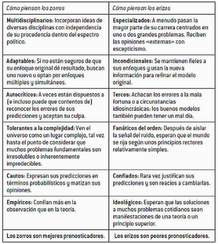

## Intensión

Este post tomo tantas introducciones distintas, como intensiones que tengo al hacerlo, pienso que como científico de datos me maravillo por cada cosa que puedo modelar o descubrir al trabajar con data, temas desde políticas públicas desde donde soy originario , hasta temas de cocina (ML enfocado a la construcción de platos) o asignación de atribuciones en televisión. El sector privado me dio una nueva perspectiva al darme un nuevo reto, y entender que temas como logística, diagnósticos médicos o creación de combo (ganadores) en temas de marketing directo tienen un patrón y un orden del cual me maravillo cada vez más. 

Al recordar las clases del periodo II (2018) en la Uniempresarial, admire la gran variedad de estudiantes que arrojaban problemas propios de sus empresas y por ello reflexione de como empezar a entender este mundo ¿ De qué debería hablar? , y es cuando pienso cómo me gustaría haber empezado, el inicio de mi carrera fue como científico social, puntualmente en desarrollo económico e historia política y uno de los retos más importantes a desarrollar como persona fue entender como funcionan los datos, y es por ello que empiezo con la analogía de [Nate Silver](https://fivethirtyeight.com/contributors/nate-silver/) sobre ser zorro o erizo (del libro La señal y el ruido)





En ese mismo libro habla de que los zorros son mejores pronosticadores porque saben que hay cuestiones que salen del marco de la estadística aplicada y del modelamiento matemático, puntualmente entender el comportamiento de lo que se estudia que es donde la psicología (principalmente) y otras disciplinas se conjugan.

Saber preguntar es todo un arte, al igual que contextualizar, y es por ello que entendí lo que decía Silver en ver el mundo en términos de probabilidades y a [Gutiérrez](https://andresgutierrez.blog/) sobre la inferencia estadística y el muestreo sobre el principio de representatividad.


## Los datos en términos de probabilidades


Pensar los datos en términos de probabilidades será la piedra angular del desarrollo del trabajo de un científico de datos, porque primero enseña como se comportan los datos y que se pueden esperar de ellos, pero para entender este aspecto , primero hay que saber algo de estadística descriptiva, dado que el tema es bien conocido y hay gran biografía de ello, prefiero dejar una presentación de [Bravo](https://www.cs.waikato.ac.nz/~fbravoma/teaching/explora.pdf) (haciendo clic en el nombre la podrá ver) sobre el tema y más bien hacer un ejemplo de ello, en base a un set de datos de películas en [kaggle](https://www.kaggle.com/tavoosi/predicting-box-office-revenue-with-random-forest/data)


```{r, echo=FALSE, cache=FALSE, message=FALSE, warning=FALSE}
library(tidyverse)
library(plotly) 
library(ggthemes) 
library(corrplot) 
library(gridExtra) 
library(VIM) 
library(lubridate) 
library(randomForest) 
library(knitr)
library(scales)
```


```{r, echo=FALSE, cache=FALSE, warning=FALSE, message=FALSE}

train <- read.csv('~/Desktop/train.csv', na.strings=c("", '#N/A', '[]', '0'))
test <- read.csv('~/Desktop/test.csv', na.strings=c("", '#N/A', '[]', '0'))

Base<-bind_rows(train, test)
```


Se explora la composición de la base de datos y se hace el resumen estadístico de la misma


```{r, echo=FALSE, cache=FALSE}
Base%>%
  glimpse()
```


Es de notar que la base de datos tiene dos componentes categóricos : numéricos y caracteres.


Se  estudiará la distribución de una de las variables numéricas , en este caso **runtime**

Lo primero a examinar es su distribución y por ello se recurre a un gráfico de histograma 
```{r, echo=FALSE, cache=FALSE, message=FALSE}
Base%>%
  na.omit()%>%
  ggplot(aes(runtime))+
  geom_histogram()+
  theme_bw()+
  labs(title = 'Distribución de Runtime', y='')+
  theme(plot.title = element_text(hjust = 0.5))
```


Parece que los datos tienen un comportamiento bimodal, para ello se somete a un test de normalidad, por lo cuál me adelantaré hacer un poco de inferencia estadística. Supongamos que los datos provienen de una distribución normal

$$
P(x) = \frac{1}{{\sigma \sqrt {2\pi } }}e^{{{ - \left( {x - \mu } \right)^2 } \mathord{\left/ {\vphantom {{ - \left( {x - \mu } \right)^2 } {2\sigma ^2 }}} \right. \kern-\nulldelimiterspace} {2\sigma ^2 }}}
$$

Donde sus propiedades son :

* $E(X)=\mu$
* $Var(X)=\sigma^2$
* $M_x(t)=exp\{ut+\frac{1}{2}\sigma^2 t^2\}$


Por lo tanto si $P-Value$ es menor que alfa(0.05) se rechaza, pero en caso contrario Se acepta que es normal
```{r, echo=FALSE, cache=FALSE, message=FALSE, warning=FALSE}
library(nortest)
library(normtest)
library(moments)
attach(Base)
ad.test(na.omit(runtime))
```

La prueba indica que es no es normal, se desarrollará un mecanismo que determine a que distribución pertenece

```{r, echo=FALSE, cache=FALSE, message=FALSE, warning=FALSE}
library(fitdistrplus)
library(logspline)
runtime%>%
  na.omit()->runtime_2
runtime_2<-as.numeric(runtime_2)
descdist(runtime_2, discrete = TRUE)
```

A este punto parece que la distribución va a ser más difícil de determinar por ello se usa otra prueba

```{r, echo=FALSE, cache=FALSE, message=FALSE, warning=FALSE}
fitdist(runtime_2, "nbinom")
ks.test(runtime_2,'pnbinom',size=40.93231,mu=108.02560)
```

La prueba pertenece a está familia de distribuciones (pensar en términos probabilisticos).

Retomando la descriptiva se puede decir lo siguiente: el promedio del tiempo de las películas es `r mean(runtime_2)`, con una variación promedio de `r sd(runtime_2)`, lo que indica que hay una variación importante entre las tiempos de las películas, ahora viene la curiosidad de erizo ¿ Existe alguna correlación entre el ingreso de las películas y su duración? y es aquí cuando empieza la ciencia y la descripción


```{r, echo=FALSE, cache=FALSE}
Base%>%
  na.omit()->a

```


Parece ser que la relación entre ingreso y tiempo de la película es `r cor(a$runtime,a$revenue)`, lo que indica que es fuerte.

```{r, echo=FALSE, cache=FALSE}
Base%>%
  na.omit()%>%
  ggplot(aes(runtime,revenue))+
  geom_point()+
  geom_smooth(method = 'lm', color = 'red3')+
  scale_y_continuous(labels = dollar)+
  theme_bw()
```

Y es así como se usa la estadística descriptiva, y con ello ya se sabe que se puede proyectar, pronosticar estás variables y trabajar en distintos modelos o algoritmos de clasificación.

## Distribuciones de probabilidad

Como se menciono al principio de este post, lo importante es pensar en los datos en términos probabilisticos  y por ello en la presente sección mostraré algunos tipos de distribuciones, como funcionan y algunos ejemplos prácticos, intentaré ser lo menos académico pero si explicativo con ello


#### Distribución Bernoulli


Es una distribución que solo tiene dos posibles resultados (éxito, fracaso), en donde los experimentos o intentos son independientes entre si. La probabilidad de tener éxito se define como $p$ y de fracaso $1-p$. La variable toma los valores $0<p<1$.

Su función de densidad es la siguiente:

$$
f_x(x)=p^x(1-p)^{(1-x)}
$$

Las propiedades de la Bernoulli son:

* $E(X)=p$
* $Var(X)=p(1-p)$
* $m_x(t)=pe^t+1-p$


Más la bernuolli es un caso particular de la Binomial , puesto está estudia el número de éxitos en $n$ ensayos y por lo tanto sus propiedades son las siguientes:

* $E(X)=np$
* $Var(x)=np(1-p)$
* $m_x(t)=(p_e^t+1-p)^n$

y su función de densidad es

$$
f_X(x)=\binom{n}{x}p^x(1-p)^{(n-x)} \mathbf{I_{0,...,n}(x)}
$$

Suponga lo siguiente:Un correo publicitario tiene el 40% de éxito de no ser tratado como spam, la empresa **X** pretende enviar 1000 correos y quiere saber lo siguiente

* ¿ Cuál es la probabilidad de que lo vean 10 personas?

La probabilidad de que lo vean 10 personas es la siguiente
```{r, echo=FALSE, cache=FALSE}
dbinom(10,1000,0.4)
```


* ¿ Cuál es la probabilidad de que lo vean 500 personas?

```{r, echo=FALSE, cache=FALSE}
paste('La probabilidad de que lo vean 500 personas es ',dbinom(500,1000,0.4))
```

* ¿ Cuál es la probabilidad de que al menos 100 personas vean 

```{r, echo=FALSE, cache=FALSE}
paste('La probabilidad de que lo vean por lo menos 100 personas es ',pbinom(100,1000,0.4))

```


* ¿ Cuál es la probabilidad de que el correo lo vean más de 400 personas?

```{r, echo=FALSE, cache=FALSE}
paste('La probabilidad de que lo vean más de 400 personas es',1- pbinom(400,1000,0.4))
```


El comportamiento de una Binomial es el siguiente a nivel gráfico

```{r, echo=FALSE, cache=FALSE, message=FALSE}
n<-2000
ma_binom<-rbinom(n,10,.4)
qplot(ma_binom,geom = 'histogram')+
  theme_bw()
```

Mientras que el gráfico comparativo es el siguiente


```{r, echo=FALSE, cache=FALSE}
x1<-ma_binom[-n]
x2<-ma_binom[-1]
qplot(x1,x2)
```


Y su función de autocorrelación es 

```{r, echo=FALSE, cache=FALSE, message=FALSE, warning=FALSE}
library(forecast)
library(cowplot)
acf(ma_binom)
```

Dato curioso: El valor más probable  a la distribución binomial esta cerca a la esperanza de los datos.

#### Distribución Hipergeométrica

Es una distribución de asignación, por ejemplo ¿ Qué tan probable es que una persona tenga un nombre dado su lugar de nacimiento?, por lo tanto se define como el número de éxitos en $m$ ensayos, en una población de tamaño $n$, por ejemplo

De un grupo de 30 científicos de datos, eligen 8 aleatoria mente, y dentro del grupo total hay 5 estadísticos 

¿ Cuál es la probabilidad de que entre los 8 seleccionados , estén 3 estadísticos del grupo de 30?


```{r, echo=FALSE, cache=FALSE}
N=30
n=8
r=3
```
Por lo tanto se debe encontrar $P=(X=3)$

Recordando que la función de densidad es la siguiente

$$
f_x(X)=Pr(X=x)=\frac{\binom{R}{x}\binom{N-R}{n-x}}{N^2(N-1)}
$$

con propiedades


* $E(X)=\frac{nR}{N}$
* $Var(X)=\frac{nR(N-R)(N-n)}{N^2(N-1)}$

Dicho lo anterior se puede decir que la probabilidad que haya tres estadísticos en los 8 seleccionados es de 

```{r, echo=FALSE, cache=FALSE}
dhyper(r,n,N-n,r)
```

Observé que prácticamente se divide el grupo en áreas de interés.

Ahora el comportamiento de está distribución es la siguiente
```{r, echo=FALSE, cache=FALSE}
nn<-2000 ## Número de simulaciones
m<-30 ## Número de muestras
k = rep(12, len=nn)   # tamaño de las muestras
n = 4 # Número de objetivos
ma_hyper<-rhyper(nn=nn, m=m, n=n, k=k)
```


```{r, echo=FALSE, cache=FALSE, message=FALSE}
qplot(ma_hyper, geom = 'histogram')+
  theme_bw()
```

y su función de comparación es


```{r, echo=FALSE, cache=FALSE}
n<-300
x1<-ma_hyper[-n]
x2<-ma_hyper[-1]
qplot(x1,x2)
```


y la función de autocorrelación

```{r, echo=FALSE, cache=FALSE}
acf(ma_hyper)
```


### Distribución de Poisson

Es la ocurrencia de un evento en un intervalo de tiempo, su función de densidad es la siguiente:

$$
f_x(x)=Pr(X=x)=\frac{e^{-\lambda}\lambda^{x}}{x!}\mathbf{I}_{\{0,1,...,n\}}
$$

Como dato curioso la función de distribución poisson presenta picos cercanos al parámetro $\lambda$

En el siguiente ejemplo $\lambda=5$
```{r, echo=FALSE, cache=FALSE}
set.seed(12345)
rpois(2000,5)->P
qplot(P,geom = 'histogram')+
  theme_bw()
```

Las propiedades de la *Poisson* son 

* $E(X)=\lambda$
* $Var(X)=\lambda$
* $m_x(t)=exp\{\lambda(e^t-1)\}$

Un aspecto interesante que resalta [Gutiérrez](https://andresgutierrez.blog/) es que la distribución Poisson por más que se sumen sus variables independientes , el total sigue teniendo distribución Poisson.

Un ejemplo sería el siguiente: A una persona $x$ le gusta interactuar con 10 personas en promedio de un día. ¿ Cuál es la probabilidad que hable con 12 en el mismo intervalo de tiempo?


```{r, echo=FALSE, cache=FALSE}
lamda=10
paste('La probabilidad de que hable con 12 personas es ',ppois(12,lamda,lower=FALSE))
```

El comportamiento de está distribución es el siguiente

```{r, echo=FALSE, cache=FALSE}
n=200
Pois<-rpois(200,30)
qplot(Pois,geom = 'histogram')
```

Mientras que su función de comparación es 

```{r, echo=FALSE, cache=FALSE}
x1<-Pois[-n]
x2<-Pois[-1]
qplot(x1,x2)
```

Y la función de autocorrelación  es

```{r, echo=FALSE, cache=FALSE}
acf(Pois)
```


## Algunas Distribuciones continuas

### Distribución uniforme continua

Dice teóricamente que al tener un intervalo [a,b], un subintervalo [c,d] tiene la misma distribución de probabilidad de ubicarse en cualquier subintervalo

Su función de densidad es 

$$
f_x(X)=\frac{1}{b-a} 
$$

Sus propiedades son:

* $E(x)=\frac{a+b}{2}$
* $Var(X)=\frac{(b-a)^2}{12}$
* $m_x(t)=\frac{e^{bt}-e^{at}}{(b-a)^t}$

```{r, echo=FALSE, cache=FALSE}
uniforme<-runif(100, min=10, max=30) 
n=100
qplot(uniforme,geom = 'histogram')
qplot(uniforme,geom = 'density')
```


Mientras que la función de comparación es 

```{r, echo=FALSE, cache=FALSE}
x1<-uniforme[-n]
x2<-uniforme[-1]
qplot(x1,x2)
```

y la función de autocorrelación es

```{r, echo=FALSE, cache=FALSE}
acf(uniforme)
```


### Distribución exponencial

En pocas palabras es el tiempo entre eventos de independientes aleatoriamente recurrente (Tiempo entre procesos Poisson), algo curioso es que está distribución es un caso especial de la gamma y tiene la siguiente estructura matemática

$$
f_x(X)=\frac{1}{\sigma}e^{-x/\sigma}
$$
Por lo tanto una variable exponencial toma valores entre $(0 , \infty)$ y puede ser útil para describir el proceso o el tiempo en que ocurre un evento , como por ejemplo : El tiempo de preparación de un expreso al vapor es de 4 minutos, ¿cuál es la probabilidad de que este mismo se haga en 3?

Recuerde que la tasa de procesamiento es la unidad entre el tiempo de finalización del proceso

```{r, echo=FALSE, cache=FALSE}
tasa=1/4
paste('La probabilidad de que un expreso se haga en tres minutos es de ',pexp(3,tasa))
```

Un ejemplo de representación es el siguiente

```{r, echo=FALSE, cache=FALSE}
n<-1000
tasa=1/3
ma_exp<-rexp(n,tasa)
qplot(ma_exp,geom = 'histogram')
```

Si se trabajase por la densidad el resultado sería el siguiente

```{r, echo=FALSE, cache=FALSE}
qplot(ma_exp,geom = 'density')
```


Mientras el gráfico de comparación es

```{r, echo=FALSE, cache=FALSE}
x1<-ma_exp[-n]
x2<-ma_exp[-1]
qplot(x1,x2)
```

Mientras que su función de autocorrelación es la siguiente:


```{r, echo=FALSE, cache=FALSE}
acf(ma_exp)
```


Cuando se quiere comprobar si los datos presentan esta distribución se realiza la prueba Kolmogorov Smirnov
(está prueba sirve para las distribuciones continuas)

```{r, echo=FALSE, cache=FALSE}
ks.test(ma_exp,'pexp',rate=1/4)
```

Recuerde que que si el pvalue es menor al parámetro alfa entonces se acepta la distribución.

Para terminar de afirmar lo anterior se trabaja con los escenarios 

```{r, echo=FALSE, cache=FALSE}
descdist(ma_exp, discrete = FALSE)
```

### Distribución Gamma

La función trabajo con procesos continuos positivos, su estructura matemática es la siguiente:


$$
f_x(X)=\frac{x^{k-1}e^{-x/\sigma}}{\sigma^{k}\Gamma(k)}
$$


```{r, echo=FALSE, cache=FALSE}
curve(expr = dgamma(x = x, shape = 2, rate = 2),
      xlab = "", ylab = "", main = "Gamma PDFs with r = 2",
      lwd = 2, col = 1, xlim = c(0, 2),
      ylim = c(0, 8))

for (i in 1:5) {
  curve(expr = dgamma(x = x, shape = 2, 
                      rate = c(3, 5, 10, 15, 20)[i]),
        lwd = 2, col = (2:6)[i], add = TRUE)
}

legend(x = "topright", legend = c("Rate = 2", "Rate = 3",
                                  "Rate = 5", "Rate = 10",
                                  "Rate = 15", "Rate = 20"),
       lwd = 2, col = 1:6)
```


Las propiedades de esta distribución son las siguientes:


* $E(X)=k\sigma$
* $Var(X)=k\sigma^2$
* $m_x(t)=(\frac{1}{1-\sigma t})^k$


### Conclusiones

Como al inicio del post se indico, lo importante es evaluar los problemas desde una perspectiva de probabilidades, saber que tipo de distribución usar y cuando usarla. Otro tema importante es entender que estás probabilidades deben ser actualizadas constantemente, porque los escenarios en el mundo real cambian.


A continuación introduciré  el tema de modelamiento estadístico, aunque está parte tendrá una post especifico 


### Modelamiento estadístico

El mundo de la ciencia de datos entiende que los datos tienen tres clases

* Análisis supervisado: En donde los datos tienen forma $\{(x_1,y_1),...,(x_n,y_n)\}$, donde $y$ es la variable de interés, por lo tanto matemáticamente se estudia la distribución de $y$ dada la condición de $x$ que son las variables explicativas.

* Análisis no supervisado: Los datos tienen forma de $\{(x_1,..,x_n)\}$, por lo tanto no se sabe cual es la variable de interés y es por ello que se intenta determinar la distribución de $x$

* Análisis por reforzamiento: Cuando no hay la suficiente información y toca aprender a través de las observaciones, este análisis se basa en particularidades y es basado en la psicología conductista.

Para construir un algoritmo de aprendizaje que permita desarrollar un modelo estadística, es necesario definir la muestra $\tau_n$, en donde se define que 

$$
M:(\equiv x \Upsilon)^n \rightarrow \mathbf{F}
$$


Donde F es el conjunto de funciones de aprendizaje que depende de una muestra , por lo tanto para diferentes muestras hay diferentes funciones de aprendizaje


Para determinar el riesgo o perdida de la función de aprendizaje entonces

$$
R(F)=E[L(X,Y,f(X))]
$$

Por lo tanto el error del entrenamiento empírico es

$$
R_{emp}(f)=\sum_{i=1}^{n} \frac{L(X_i,Y_i,f(X_i))}{n}
$$

donde el error de la prueba es definido por el valor esperado a la distribución


$$
R(F)=E[L(X,Y,f(X))]
$$


Por lo tanto el error de la prueba esperado (Riesgo esperado) es 

$$
E[R(f_n)]
$$


Por lo tanto la función de aprendizaje generalizada será:

$$
|R_{emp}(f)-R(f)|
$$