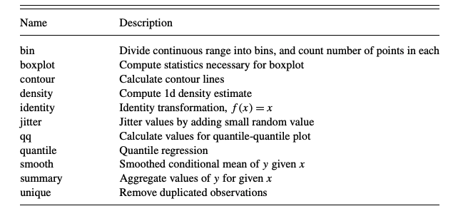

```{r, echo=FALSE, cache=FALSE, warning=FALSE, message=FALSE}
library(tidyverse)
library(tidytext)
library(emo)
library(glue)
theme_set(theme_bw())
```

## Una apreciación a un problema menor

El diseño de gráficos estadísticos tiene dos componentes principales: i) el arte de saber transmitir la información y la idea y ii) el procesamiento que está detras de ello. Pero cuando se desagrega de manera eficiente, los highlight  tienden a no verse de la manera apropiada y es de aceptar que para este problema hay varias soluciones practicas, pero en terminos de eficiencia de código puede que no 👨🏻
💻.

Y es por lo anterior que se usan funciones auxiliares para poder desarrollar de manera apropiada este tipo de gráficos desagregados (facetting). No sobra recordar que **The Grammar of Graphics**(1980) explicaba que las etapas del desarrollo de los gráficos consiste en :

* Generar reglas que deriven en la explicación de un problema : Barplots, Points, etc.

* Desarrollar la matemática que está detrás de la simbología.

* Entender y saber relacionar los componentes que se necesitan.


Pero ante lo anterior surgen una serie de preguntas ¿ Qué es un gráfico?, ¿ Qué debe describir un gráfico?. 

Una de las definiciones que más me gusta es la da [Hadley Wickham](http://hadley.nz/), en donde describe a un gráfico como un conector de ideas a través de variables. Con respecto a lo que debe describir un gráfico se puede decir de manera corta como: Hallazgos y conclusiones.


## Las leyes de la gramática de los gráficos


En su ensayo **A Layered Grammar of Graphics** Wickham define los niveles (las leyes) que debe cumplir todo gráfico


* Datos : Sobre los cuales se desarrollaran operaciones matemáticas que deriven en la conexión de variables y con ello de entendimiento.

* Elementos : La geometría y la posición que tendrá la data.

* Escala : La unidad de medida unificada por coordenada

* Coordenadas : El mapa que sigue el gráfico.

Las transformaciones estadísticas que van dentro de los gráficos se pueden definir de la siguiente manera:


Tomado de :[A LAYERED GRAMMAR OF GRAPHICS](https://byrneslab.net/classes/biol607/readings/wickham_layered-grammar.pdf)


## Facetting

Esta condición es la que permite separar los gráficos por alguna de las variables que permita desagregación y precisión.


## Un ejemplo


```{r, echo=FALSE, cache=FALSE, message=FALSE, warning=FALSE}
media_franchises <- readr::read_csv("https://raw.githubusercontent.com/rfordatascience/tidytuesday/master/data/2019/2019-07-02/media_franchises.csv")
```

Se explora un poco la data

```{r, echo=FALSE, cache=FALSE}
franchises <- media_franchises %>%
  group_by(franchise, original_media, year_created, creators, owners) %>%
  summarize(categories = n(),
            total_revenue = sum(revenue),
            most_profitable = revenue_category[which.max(revenue)]) %>%
  ungroup()

franchises%>%
  head(10)%>%
  arrange(desc(total_revenue))%>%
  knitr::kable(format = 'html', caption = 'Data Agrupada')
```


Respetando las reglas de los gráficos se desarrolla un modelo matemático sencillo para el ejemplo


```{r, echo=FALSE, cache=FALSE}
franchises_q<-franchises%>%
  count(original_media, sort = TRUE)%>%
  ungroup()

franchises_q%>%
  knitr::kable(format = 'html', caption = 'Análisis de frecuencia por el formato')


```

Paso seguido se estudia el promedio del `revenue` a través de la franquicia.

```{r}
Avg_fraq<-franchises%>%
  group_by(franchise,original_media)%>%
  summarize(Avg_Revenue = mean(total_revenue))%>%
  ungroup()%>%
  mutate(franchise = fct_reorder(franchise,Avg_Revenue))

Avg_fraq%>%
  knitr::kable(format = 'html',caption = 'Relación de la franquicia por el promedio de los ingresos')
```


Paso seguido se desarrolla un gráfico con facetting en `original_media`


```{r}
franq_sort<-franchises%>%
  mutate(decade = (year_created%/% 10)*10)%>%
  group_by(decade)%>%
  count(original_media,sort = TRUE)%>%
  ungroup()

franq_sort%>%
  group_by(decade)%>%
  top_n(10)%>%
  ungroup()%>%
  mutate(decade = as.factor(decade))%>%
  ggplot(aes(original_media,n,fill=decade))+
  geom_col(show.legend = FALSE)+
  facet_wrap(~decade, scales = 'free_y')+
  scale_y_continuous(expand = c(0,0)) +
  coord_flip()

```


Como se puede observar, no hay un ordenamiento claro y es por ello que se usará el paquete `tidytext`[^2], el cual permite a través de `reorder_within` solucionar el problema de cardinalidad.


```{r}
franq_sort%>%
  group_by(decade)%>%
  top_n(10)%>%
  ungroup()%>%
  mutate(decade = as.factor(decade),
         original_media = reorder_within(original_media,n,decade))%>%
  ggplot(aes(original_media,n,fill=decade))+
  geom_col(show.legend = FALSE)+
  facet_wrap(~decade, scales = 'free_y')+
  scale_x_reordered() +
  scale_y_continuous(expand = c(0,0)) +
  coord_flip()
```

Y así con la función auxiliar, los gráficos quedan ordenados y computacionalmente el código es más eficiente.

Al desarrollar un análisis más eficiente combinando una pregunta de negocio o de contexto versus las leyes de la gramática de los gráficos. Una medidas poco robusta pero que se usará para este caso será el promedio, a través de el se intentará determinar a través de las decadas cuál es la franquicia que mejor *revenue* ha tenido.


```{r, message=FALSE}
franchises%>%
  mutate(decade = (year_created%/% 10)*10)%>%
  group_by(decade, original_media, franchise)%>%
  summarize(Avg_revenue = mean(total_revenue))%>%
  ungroup()%>%
  mutate(franchise = fct_reorder(franchise,Avg_revenue))%>%
  top_n(40)%>%
  ggplot(aes(franchise,Avg_revenue, fill= original_media))+
  geom_col(show.legend = TRUE)+
  labs(title = "Relación de las franquicias en el tiempo", subtitle = "A través del valor promedio de sus ganancias", fill="")+
  facet_wrap(~decade, scales = 'free')+
  coord_flip()+
  theme(legend.position=c(0.8,0.1), legend.direction = 'horizontal', legend.box = "vertical", legend.text = element_text(size = 3),
        legend.title = element_text(size = 3), legend.key.size = unit(0.3,"cm"))

```

Y así el facetting cumple los sigiuentes objetivos:

* Ordenar por las fases que se piden ,
* Dar a entender una idea,
* Calcular y representar una idea.


Por último se evalua el nivel de volatilidad de los ingresos por cada una de las franquicias desde 1970, en donde el resultado es el siguiente.

```{r, echo=FALSE, cache=FALSE}
franchises%>%
  mutate(decade = (year_created%/% 10)*10)%>%
  filter(decade>1960)%>%
  group_by(franchise, original_media, decade)%>%
  summarize(Total_revenue = total_revenue*1)%>%
  ungroup()%>%
  mutate(decade = factor(decade),
         original_media = reorder_within(original_media,Total_revenue,decade))%>%
  ggplot(aes(original_media, Total_revenue, fill=factor(decade)))+
  geom_boxplot()+
  guides(fill=FALSE)+
  facet_wrap(~decade, scales = 'free')+
  scale_x_reordered() +
  scale_y_continuous(expand = c(0,0)) +
  coord_flip()

```

Para finalizar quiero resaltar la importancia del `tidytext` para el diseño de gráficos, si desea conocer mayor bibliografía o conocer mejores practicas, recomiendo el blog de [Cédric Scherer](https://cedricscherer.netlify.com/).


[^1]:https://github.com/tidyverse/glue
[^2]:https://cran.r-project.org/web/packages/tidytext/vignettes/tidytext.html

