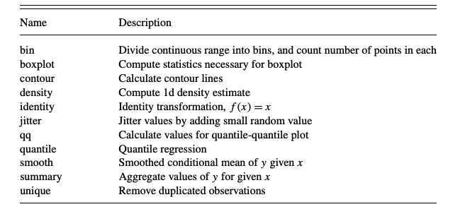

## Una apreciación a un problema menor

El diseño de gráficos estadísticos tiene dos componentes principales: i) el arte de saber transmitir la información y la idea y ii) el procesamiento que está detras de ello. Pero cuando se desagrega de manera eficiente, los highlight  tienden a no verse de la manera apropiada y es de aceptar que para este problema hay varias soluciones practicas, pero en terminos de eficiencia de código puede que no 👨🏻
💻.

Y es por lo anterior que se usan funciones auxiliares para poder desarrollar de manera apropiada este tipo de gráficos desagregados (facetting). No sobra recordar que **The Grammar of Graphics**(1980) explicaba que las etapas del desarrollo de los gráficos consiste en :

* Generar reglas que deriven en la explicación de un problema : Barplots, Points, etc.

* Desarrollar la matemática que está detrás de la simbología.

* Entender y saber relacionar los componentes que se necesitan.

Pero ante lo anterior surgen una serie de preguntas ¿ Qué es un gráfico?, ¿ Qué debe describir un gráfico?. 

Una de las definiciones que más me gusta es la da [Hadley Wickham](http://hadley.nz/), en donde describe a un gráfico como un conector de ideas a través de variables. Con respecto a lo que debe describir un gráfico se puede decir de manera corta como: Hallazgos y conclusiones.

## Las leyes de la gramática de los gráficos

En su ensayo **A Layered Grammar of Graphics** Wickham define los niveles (las leyes) que debe cumplir todo gráfico

* Datos : Sobre los cuales se desarrollaran operaciones matemáticas que deriven en la conexión de variables y con ello de entendimiento.

* Elementos : La geometría y la posición que tendrá la data.

* Escala : La unidad de medida unificada por coordenada

* Coordenadas : El mapa que sigue el gráfico.

Las transformaciones estadísticas que van dentro de los gráficos se pueden definir de la siguiente manera:

Tomado de :[A LAYERED GRAMMAR OF GRAPHICS](https://byrneslab.net/classes/biol607/readings/wickham_layered-grammar.pdf)

## Facetting

Esta condición es la que permite separar los gráficos por alguna de las variables que permita desagregación y precisión.

## Un ejemplo

Se explora un poco la data

Table: Data Agrupada

franchise                                   original_media     year_created  creators                                  owners                                                                       categories   total_revenue  most_profitable                 
------------------------------------------  ----------------  -------------  ----------------------------------------  --------------------------------------------------------------------------  -----------  --------------  --------------------------------
Anpanman                                    Manga                      1973  Takashi Yanase                            Froebel-kan                                                                           2          60.092  Merchandise, Licensing & Retail 
Batman                                      Comic book                 1939  Bob Kane Bill Finger                      DC Entertainment (AT&T)                                                               4          25.040  Merchandise, Licensing & Retail 
Barbie                                      Animated film              1987  Ruth Handler                              Mattel                                                                                3          23.005  Merchandise, Licensing & Retail 
Avengers                                    Comic book                 1963  Stan Lee  Jack Kirby                      Marvel Entertainment (The Walt Disney Company)                                        4          12.590  Box Office                      
Angry Birds                                 Video game                 2009  Jaakko Iisalo                             Rovio                                                                                 4           8.480  Merchandise, Licensing & Retail 
Ben 10                                      Animated series            2005  Man of Action Studios                     Cartoon Network (AT&T)                                                                1           7.000  Merchandise, Licensing & Retail 
A Song of Ice and Fire /  Game of Thrones   Novel                      1996  George R. R. Martin                       Random House WarnerMedia (AT&T)                                                       5           5.313  TV                              
Aladdin                                     Animated film              1992  Walt Disney Animation Hanna Diyab         The Walt Disney Company (franchise)  Sega Sammy Holdings (games/pachinko)             5           4.907  Video Games/Games               
Assassin's Creed                            Video game                 2007  Patrice Désilets Jade Raymond Corey May   Ubisoft                                                                               3           4.253  Video Games/Games               
Beyblade                                    Manga                      1999  Takao Aoki                                Shogakukan (Hitotsubashi Group)                                                       2           4.009  Merchandise, Licensing & Retail 

Respetando las reglas de los gráficos se desarrolla un modelo matemático sencillo para el ejemplo

Table: Análisis de frecuencia por el formato

original_media        n
------------------  ---
Video game           27
Manga                17
Animated film         8
Animated series       8
Novel                 8
Television series     7
Comic book            6
Film                  5
Animated cartoon      3
Anime                 3
Book                  2
Digital pet           2
Greeting card         2
Cartoon               1
Cartoon character     1
Comic strip           1
Musical theatre       1
Visual novel          1

Paso seguido se estudia el promedio del `revenue` a través de la franquicia.


Avg_fraq<-franchises%>%
  group_by(franchise,original_media)%>%
  summarize(Avg_Revenue = mean(total_revenue))%>%
  ungroup()%>%
  mutate(franchise = fct_reorder(franchise,Avg_Revenue))

Avg_fraq%>%
  knitr::kable(format = 'pandoc',caption = 'Relación de la franquicia por el promedio de los ingresos')


Table: Relación de la franquicia por el promedio de los ingresos

franchise                                   original_media       Avg_Revenue
------------------------------------------  ------------------  ------------
A Song of Ice and Fire /  Game of Thrones   Novel                      5.313
Aladdin                                     Animated film              4.907
Angry Birds                                 Video game                 8.480
Anpanman                                    Manga                     60.092
Assassin's Creed                            Video game                 4.253
Avengers                                    Comic book                12.590
Barbie                                      Animated film             23.005
Batman                                      Comic book                25.040
Ben 10                                      Animated series            7.000
Beyblade                                    Manga                      4.009
Bleach                                      Manga                      7.066
Bob the Builder                             Animated series            5.000
Call of Duty                                Video game                17.000
Candy Crush Saga                            Video game                 4.000
Care Bears                                  Greeting card              5.052
Cars                                        Animated film             21.654
CrossFire                                   Video game                10.000
DC Extended Universe                        Film                       6.204
Despicable Me / Minions                     Animated film              6.686
Detective Conan / Case Closed               Manga                      5.685
Digimon                                     Digital pet                5.968
Disney Princess                             Animated series           44.042
Dora the Explorer                           Animated series           15.250
Doraemon                                    Manga                      6.000
Dragon Ball                                 Manga                     21.825
Dragon Quest                                Video game                11.465
Dungeon Fighter Online                      Video game                10.000
Fast & Furious                              Film                       5.466
Fate                                        Visual novel               3.569
Final Fantasy                               Video game                11.199
Fist of the North Star                      Manga                     20.468
Friends                                     Television series          4.130
Frozen                                      Animated film             10.473
Gran Turismo                                Video game                 4.000
Grand Theft Auto                            Video game                 9.000
Gundam                                      Anime                     25.525
Halo                                        Video game                 6.000
Hello Kitty                                 Cartoon character         80.026
Hunter × Hunter                             Manga                      3.351
Ice Age                                     Animated film              3.000
James Bond                                  Novel                     13.901
JoJo's Bizarre Adventure                    Manga                      8.860
Jurassic Park                               Novel                      7.678
KochiKame                                   Manga                     15.817
Kumamon                                     Cartoon                    4.065
League of Legends                           Video game                 8.000
Looney Tunes                                Animated cartoon          13.299
Mario                                       Video game                35.021
Marvel Cinematic Universe                   Film                      31.000
Mickey Mouse & Friends                      Animated cartoon          69.737
Middle-earth / Lord of the Rings            Novel                     18.722
Minecraft                                   Video game                 5.000
Mission: Impossible                         Television series          3.146
Monster Strike                              Video game                 7.010
Mortal Kombat                               Video game                 1.173
My Little Pony                              Animated cartoon           4.071
Naruto                                      Manga                      8.854
Neon Genesis Evangelion                     Anime                     15.237
One Piece                                   Manga                     17.433
Pac-Man                                     Video game                15.032
PAW Patrol                                  Animated series            7.000
Peanuts                                     Comic strip               17.285
Pirates of the Caribbean                    Film                       6.000
Pokémon                                     Video game                90.863
Pretty Cure / Glitter Force                 Anime                      7.228
Puzzle & Dragons                            Video game                 7.000
Resident Evil                               Video game                 4.688
Rurouni Kenshin / Samurai X                 Manga                      3.570
Sailor Moon                                 Manga                     14.319
Sesame Street / The Muppets                 Television series          7.646
Shōnen Jump / Jump Comics                   Manga                     33.217
Shrek                                       Novel                      4.275
Slam Dunk                                   Manga                      4.658
Sonic the Hedgehog                          Video game                 7.007
Space Invaders                              Video game                13.000
Spider-Man                                  Comic book                24.550
SpongeBob SquarePants                       Animated series           13.465
Star Trek                                   Television series          9.326
Star Wars                                   Film                      63.004
Strawberry Shortcake                        Greeting card              4.002
Street Fighter                              Video game                11.235
Super Sentai / Power Rangers                Television series         29.233
Superman                                    Comic book                13.152
Tamagotchi                                  Digital pet                5.160
Teenage Mutant Ninja Turtles                Comic book                12.735
The Big Bang Theory                         Television series          4.000
The Hunger Games                            Novel                      2.475
The Lion King                               Animated film             12.987
The Phantom of the Opera                    Musical theatre            6.155
The Simpsons                                Animated series           13.527
Thomas & Friends                            Book                       8.020
Toy Story                                   Animated film             19.540
Transformers                                Animated series           15.740
Twilight                                    Novel                      5.388
Ultraman                                    Television series         11.242
Warcraft                                    Video game                10.451
Westward Journey                            Video game                 6.000
Wii series                                  Video game                14.000
Winnie the Pooh                             Book                      74.519
Wizarding World / Harry Potter              Novel                     28.108
X-Men                                       Comic book                 7.033
Yo-kai Watch                                Video game                 4.023
Yu-Gi-Oh!                                   Manga                     18.567

Paso seguido se desarrolla un gráfico con facetting en `original_media`


franq_sort<-franchises%>%
  mutate(decade = (year_created%/% 10)*10)%>%
  group_by(decade)%>%
  count(original_media,sort = TRUE)%>%
  ungroup()

franq_sort%>%
  group_by(decade)%>%
  top_n(10)%>%
  ungroup()%>%
  mutate(decade = as.factor(decade))%>%
  ggplot(aes(original_media,n,fill=decade))+
  geom_col(show.legend = FALSE)+
  facet_wrap(~decade, scales = 'free_y')+
  scale_y_continuous(expand = c(0,0)) +
  coord_flip()



## Selecting by n


Como se puede observar, no hay un ordenamiento claro y es por ello que se usará el paquete `tidytext`[^2], el cual permite a través de `reorder_within` solucionar el problema de cardinalidad.


franq_sort%>%
  group_by(decade)%>%
  top_n(10)%>%
  ungroup()%>%
  mutate(decade = as.factor(decade),
         original_media = reorder_within(original_media,n,decade))%>%
  ggplot(aes(original_media,n,fill=decade))+
  geom_col(show.legend = FALSE)+
  facet_wrap(~decade, scales = 'free_y')+
  scale_x_reordered() +
  scale_y_continuous(expand = c(0,0)) +
  coord_flip()



## Selecting by n


Y así con la función auxiliar, los gráficos quedan ordenados y computacionalmente el código es más eficiente.

Al desarrollar un análisis más eficiente combinando una pregunta de negocio o de contexto versus las leyes de la gramática de los gráficos. Una medidas poco robusta pero que se usará para este caso será el promedio, a través de el se intentará determinar a través de las decadas cuál es la franquicia que mejor *revenue* ha tenido.


franchises%>%
  mutate(decade = (year_created%/% 10)*10)%>%
  group_by(decade, original_media, franchise)%>%
  summarize(Avg_revenue = mean(total_revenue))%>%
  ungroup()%>%
  mutate(franchise = fct_reorder(franchise,Avg_revenue))%>%
  top_n(40)%>%
  ggplot(aes(franchise,Avg_revenue, fill= original_media))+
  geom_col(show.legend = TRUE)+
  labs(title = "Relación de las franquicias en el tiempo", subtitle = "A través del valor promedio de sus ganancias", fill="")+
  facet_wrap(~decade, scales = 'free')+
  coord_flip()+
  theme(legend.position=c(0.8,0.1), legend.direction = 'horizontal', legend.box = "vertical", legend.text = element_text(size = 3),
        legend.title = element_text(size = 3), legend.key.size = unit(0.3,"cm"))


Y así el facetting cumple los sigiuentes objetivos:

* Ordenar por las fases que se piden ,
* Dar a entender una idea,
* Calcular y representar una idea.

Por último se evalua el nivel de volatilidad de los ingresos por cada una de las franquicias desde 1970, en donde el resultado es el siguiente.

Para finalizar quiero resaltar la importancia del `tidytext` para el diseño de gráficos, si desea conocer mayor bibliografía o conocer mejores practicas, recomiendo el blog de [Cédric Scherer](https://cedricscherer.netlify.com/).

[^1]:https://github.com/tidyverse/glue
[^2]:https://cran.r-project.org/web/packages/tidytext/vignettes/tidytext.html

