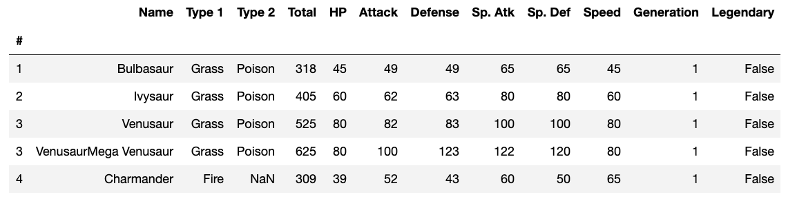
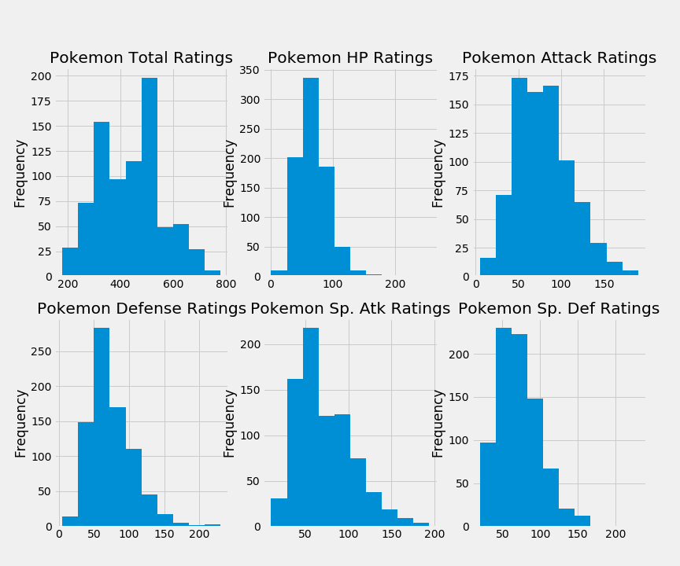
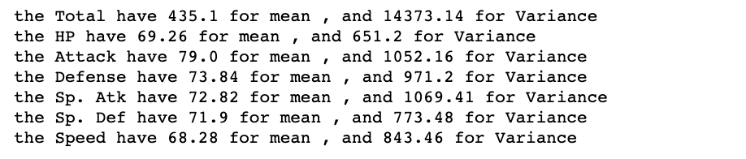
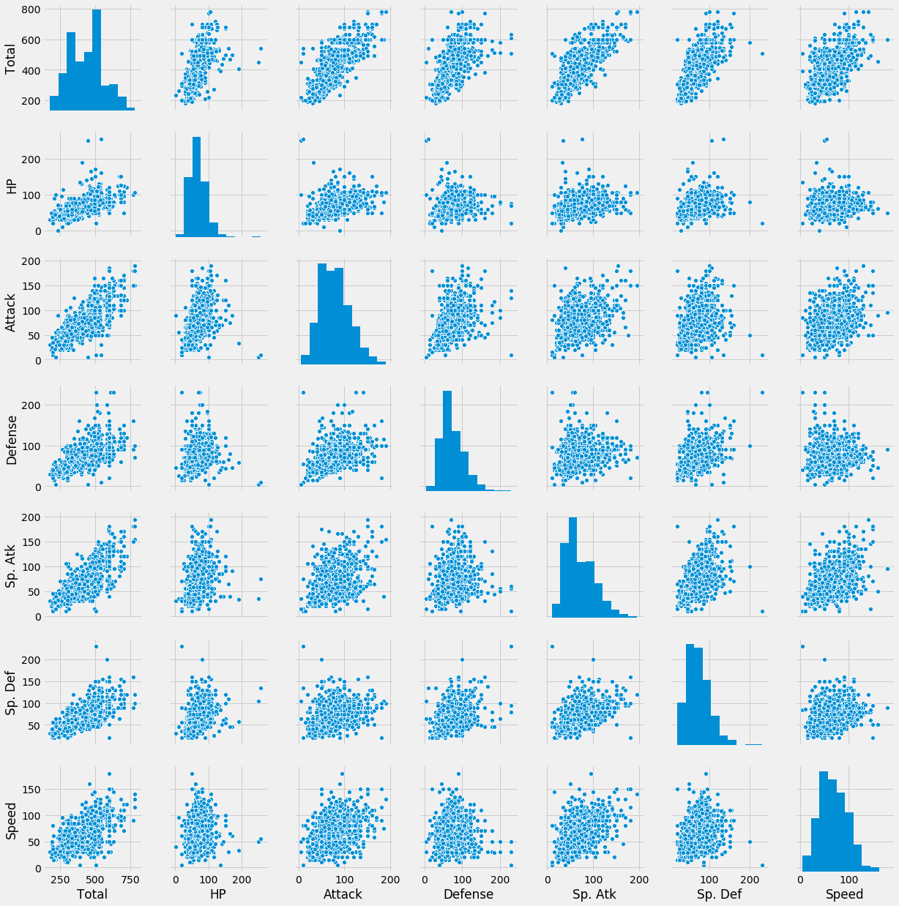
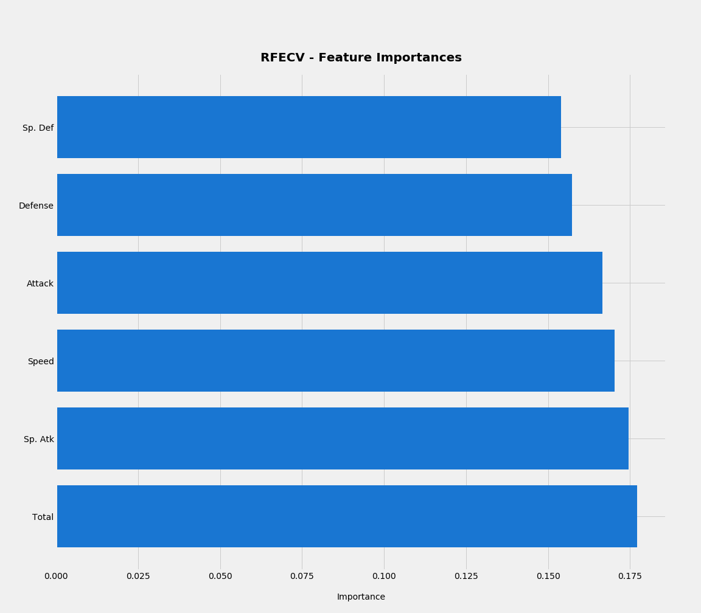
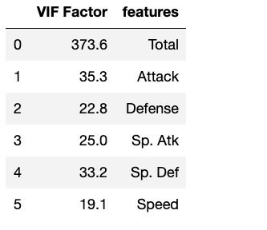
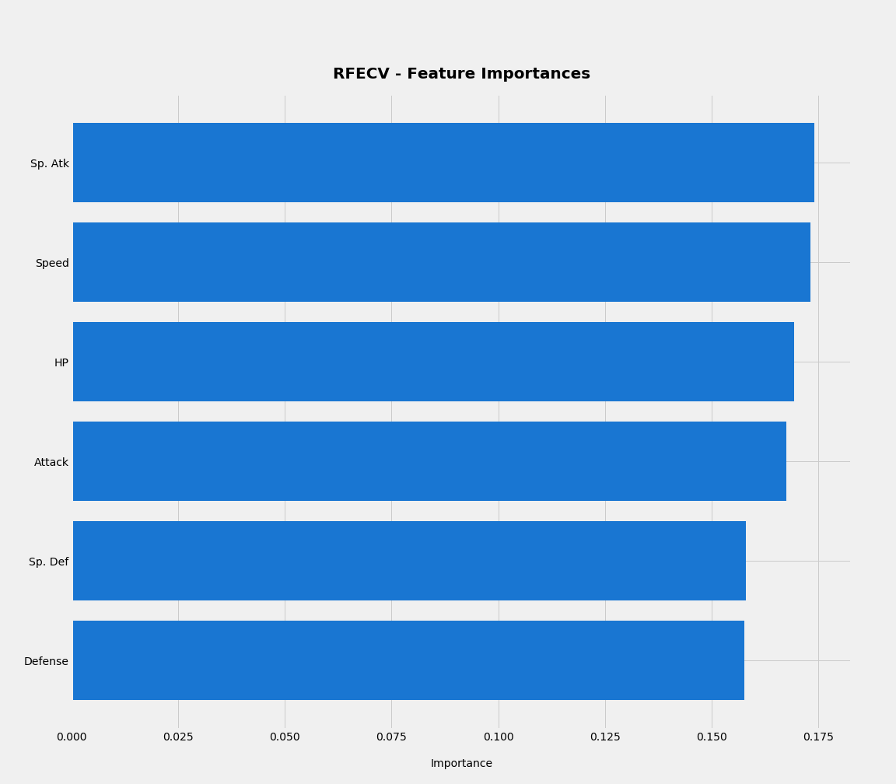
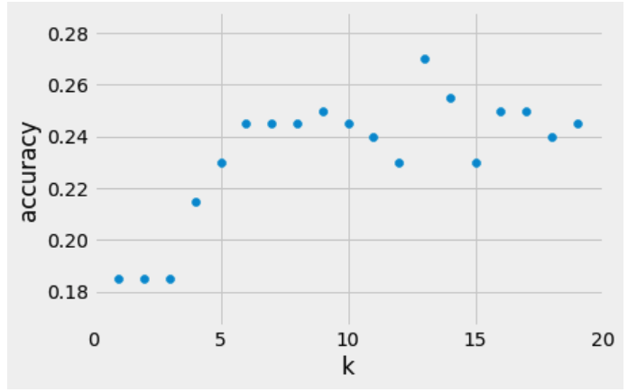
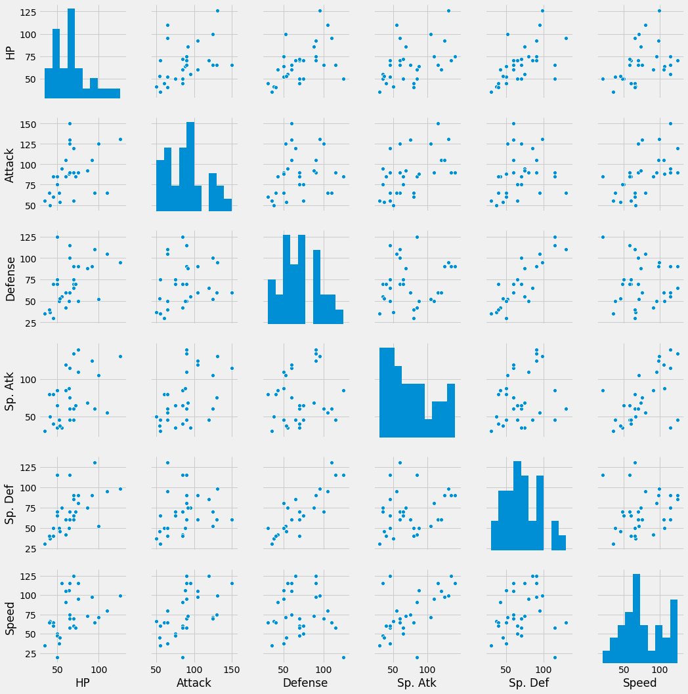

En el mundo del machine learning hay algoritmos que sirven para clasificar y pronósticar al mismo tiempo, como es el caso del **k-NN**. Dicho lo anterior hay que hacer unas salvedades:

* El K-nn es uno de los modelos de Machine Learning más sencillos.

* Pero eso no quiere decir que no se pueda complementar o que en ciertas ocaciones no pueda ser robusto. 

* El nivel de interpretabilidad del mismo es alto, y este debe ser el objetivo a perseguir

## Una aproximación teorica 

El verdadero nombre del [**k-NN**](https://es.wikipedia.org/wiki/K_vecinos_m%C3%A1s_pr%C3%B3ximos) es k (que corresponde al número de clusters observables) nearest neighbors , la filosfía de este tipo de modelos es buscar la existencia de similaridad entre grupos de datos y a través de la misma determinar la función de similaridad para clasificar los datos.

Una forma de explicarlo de manera oportuna es a través de un ejemplo en donde desarrollaré un Análisis exploratorio de datos breve, paso seguido la selección recursiva de variables a través de un modelo de Random Forest y por último se desarrollará una predicción con base al modelo seleccionado.

## Un análisis exploratorio breve 

Por temas de practicidad jugare con la base de datos de `pokemon`, dado que pienso que es donde en breve palabras puedo mostrar el potencial del modelo.

La base de datos tiene la siguiente estructura 

Donde el comportamiento entre sus variables es la siguiente

A través de las correlaciones se puede apreciar que hay algunas magnitudes de correspondencia (dirección) importantes.

Paso seguido se explora la distribución de las variables.


def get_best_distribution(data):
    dist_names = ["norm", "exponweib", "weibull_max", "weibull_min", "pareto", "genextreme",'lognorm']
    dist_results = []
    params = {}
    for dist_name in dist_names:
        dist = getattr(stats, dist_name)
        param = dist.fit(data)
        params[dist_name] = param
        D, p = stats.kstest(data, dist_name, args=param)
        dist_results.append((dist_name, p))

    
    best_dist, best_p = (max(dist_results, key=lambda item: item[1]))
    

    #print(str(best_dist))

    return best_dist


Lo cual resulta en lo siguiente 

Después del análisis correlacional y de la distribución de las variables, lo siguiente que debe explorar un ingeniero de machine learning es la selección de las variables y para ello se usa un modelo de Random Forest, donde va a identificar a través de las variables y ramas como conseguir el objetivo de clasificación validando que tanto aportan cada uno de los labels al `goal`.

El modelo de random forest para seleccionar variables se basa en **wapper** en donde genera diferentes modelos agregando y eliminando predictores buscando la combinación optima de variables.

En este caso para pokemon dio el siguiente resultado

Cabe notar que acá hay un problema con la variable total , y es que puede tener factor de inflamación de la varianza , y para ello se desarrolla el siguiente análisis

En efecto la variable total es la suma de otras variables , por lo cual usarla en este modelo sería altamente peligroso, y dicho lo anterior se elimina la variable y se vuelve a correr el análisis de selección de predictores.

Después del desarrollo del análisis estadistico y la selección de variables se construye el modelo.

Lo primero es determinar el k optimo

Como se sabe que $k=13$, entonces se genera el modelo


X = data_hist
y = pokemon['Type 1']
X_train, X_test, y_train, y_test = train_test_split(X, y, random_state=0)

X = data_hist
y = pokemon['Type 1']

X_train, X_test, y_train, y_test = train_test_split(X, y, random_state=0)
from sklearn.neighbors import KNeighborsClassifier

knn = KNeighborsClassifier(n_neighbors = 13)


Una vez desarrollado el modelo se crea un escenario para medir la clasificación


pokemon_prediction = knn.predict([[80,77,130,70,135,40]])


Donde el resultado es Dark y si se evalua a través de las distribuciones del tipo cumplen todas las condiciones por lo tanto el candidato es bueno

