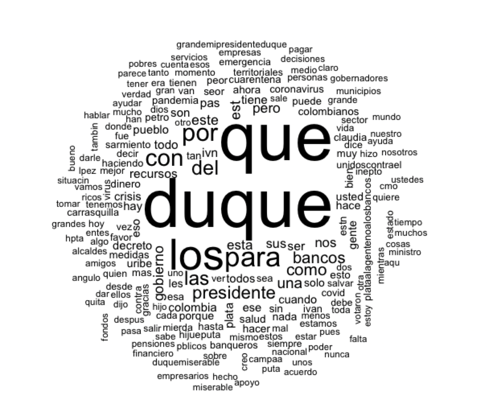
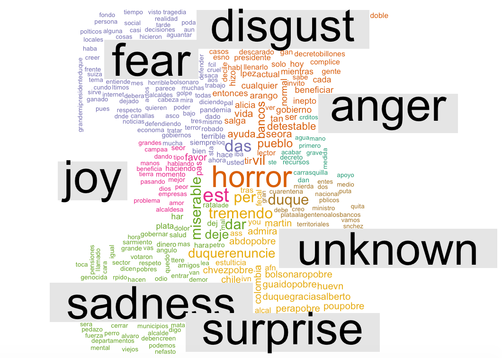

## El monarca equivocado

Durante los últimos dos siglos, la repercusión del fundamento del estado bajo la doctrina de Santo Tomás, imprenta del estatuo social, versus la dicótoma del estado Maquiavelico ha dejado en la región el surgimiento de los dictadores extraviados y el monopolio del discurso. 

Dicho sustento va en la evolución de la idea de la mano de Dios de Tomás hasta la de [Smith](https://es.wikipedia.org/wiki/La_riqueza_de_las_naciones) con su **de la mano invisible**, entendida como el surgimiento de las clases dominantes sobre el derecho divino de los recursos públicos.

Esta introducción basada en la filosofía del origen institucional de Colombia intenta responder el origen de la diferencia de lo que debería ser el Estado como ente social, practica que [Vitoria](https://es.wikipedia.org/wiki/Francisco_de_Vitoria) ataco primero como el **derechos de los hombres** piedra angular del derecho humano, a la practica Colombiana de los caudillos - feudalistas.

El origen de está institucionalidad parte en 1612 , cuando la iglesia genero los libros prohibidos, generando un retraso en el pensamiento racional Español ( y por consecuente de los colonizados), dando origen años más tarde a los dictadores que Maquiavelo plasmó en el príncipe. Pero ¿cómo marcó esta prohibición el desencadenante que ahora vivimos en la región? la respuesta es complicada a nivel de historia comparada, pero fácil de entender a través de la herencia; El poder en manos de una sola persona.

Durante la época de colonización, los españoles venían con la idea de fomentar una nueva religión basada en el miedo , y en el  **Leviatan** de Hobbes , impusieron una doctrina la cual definió Morse como : "La naturaleza predominante del Estado sobre el individuo"

Dicha naturaleza fomento la guerra entre todos durante el siglo XV y el XVI, pero se viralizó con la independencia de los estados en una versión más intima : Entre los mismos ciudadanos , en el caso de Colombia sobra decir que desde los partidos políticos como fue la guerra de los mil días , hasta la guerra contra las disidencias (ELN, FARC).

EL origen de dichas peleas corresponde a la ruptura de un pacto entre -El estado y el pueblo-, puesto que en palabras del mismo Francisco Suárez se rompe el derecho (por que si) a la dominación legitima.

En este punto quiero desarrollar la idea del monarca, en su versión histórica , EL padre Suárez afirmaba al hombre en la política llegaba bajo tres pilares 

* La moral;
* La metafísica y 
* La religión

Si vemos está triada , corresponde a la suma de las razones por las cuales en el último siglo han sido seleccionados los últimos presidentes de Colombia y como tal tienen un perfil entre todos mesiánicos, unos por la paz y otros por la seguridad. Lo único que los diferencia entre si, es que uno casi logra su objetivo y los otros se extraviaron en la definición de su objetivo.

Esta triada vista desde el punto de vista teológico correspondiente a la estructura del Estado - Nación de Colombia que viraliza en el hecho de la  aceptación (casi sin reproches) de la transición del poder a un monarca el cual se vuelve el centro de la vida social de un país.

Por  lo anterior , en ¿qué se equivoca el monarca?, en la percepción de su realidad versus la realidad, la apuesta política en contra la realidad de los individuos. Prácticamente su concepción entre lo que está bien hecho y lo que se debió hacer en términos institucionales, lo cual me recuerda al libro de Benito Cereno, en donde el capitán de un Barco termina siendo esclavo de sus allegados y logra engañar a los otros capitanes que tarde descubren quien era el verdadero líder. Recordando la frase de aquel NN : "El crimen perfecto es aquel que se resuelve con un falso culpable" (Tomado de la película el Crimen Perfecto)

Dicho lo anterior y en mi labor científica debo declarar la razón de esta reflexión : ¿ En qué se equivoca el monarca? A lo Benito Cereno (quien en realidad existió), en la intensión de sus acciones.

Usando una herramienta de las ciencias de la computación , NLP, extraigo los últimos sentimientos en las redes sociales (que debería llamarse micrófono social) sobre las decisiones tomadas por el monarca.

La anterior nube de palabras , son aquellas que más se mencionan en twitter, pero lo importante es declarar el sentimiento del pueblo con respecto a las actuaciones del presidente

El gráfico es claro sobre la tendencia de las actuaciones en cuatro principales términos : Disgusto, miedo, peligro y sorpresa.

Las reflexiones sobre estos resultados las dispongo para el fuero interno de cada uno, más me hago una última pregunta sobre estos hechos: Al mejor estilo de la narración de Benito Cereno, ¿ No seremos nosotros como los capitanes Americanos de los barcos ? ¿ No estaremos confundiendo al capitán con el tripulante ? o dicho de otra forma : ¿Quién es verdadero tripulante y quién el Capitán?

