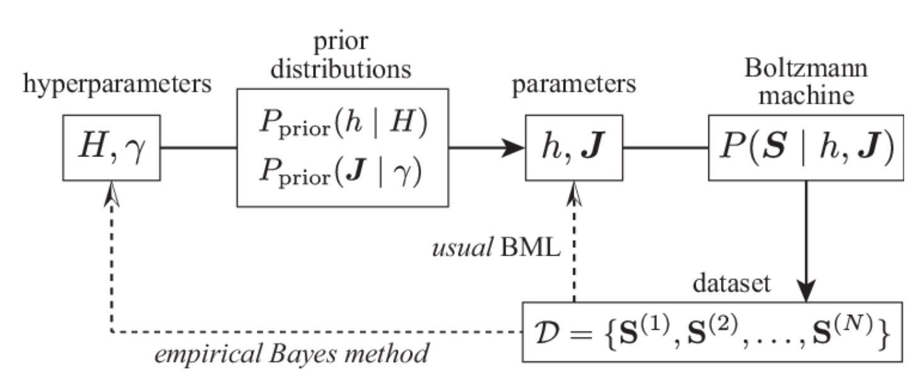

```{r setup, include=FALSE}
knitr::opts_chunk$set(echo = TRUE)
```

> "Pensar todo en términos de probabilidades" Nate Silver(La señal y el ruido)


Este es un post que he re-escrito un número determinado de veces, y es por un motivo muy especial, pienso y siento que es la esencia de la ciencia de datos y la ingeniería del Machine Learning. El análisis Bayesiano de datos tiene su poder en intentar responder cómo es el comportamiento de la probabilidad de probabilidades de una distribución cuando desconocemos los parámetros $\alpha$ y $\beta$. Estos ajustes se dan con respecto a los datos y es ese el mejor fit que tenemos para trabajar con las distribuciones y sus actualizaciones (prior y posterior).

Dicho lo anterior extraigo una frase de [Robinson](http://varianceexplained.org/)

>"“This is the Bayesian philosophy in a nutshell: we start with a prior distribution, see some evidence, then update to a posterior distribution”[^1]

La estructura de este método se basa en el siguiente workflow:




## Estimaciones Bayesianas

La estimaciones bayesianas se basan en un proceso de inferencia estadística sobre la estimación de la prior. En este caso la **prior** se interpreta como la cantidad de incertidumbre que reflejan los datos o su distribución antes de tomarse en cuenta.

Un ejemplo que usa Robinson en su texto **Emprirical Bayes** es el siguiente:

* Suponga que usted es un reclutador de jugadores de beisbol ;
* Tiene que elegir a uno de los dos jugadores que tengan la mejor tasa de bateo;
* Se considera que una buena tasa de bateo es del 27%;
* Encontro que el jugador a tiene el siguiente promedio de bateo
$$
\mbox{Jugador a} = \frac{4}{10}
$$

Mientras que el jugador B tiene el siguiente promedio

$$
\mbox{Jugador b} = \frac{300}{1000}
$$

En este caso no se posee la suficiente evidencia para decir que el jugador a es mejor que el b, dado el histórico de la data, y es en este caso cuando se puede hacer uso del método del empirical bayes para determinar un valor aproximado de como será la tasa de bateo.

En el paquete de Lahman se incluye una información sobre este problema, la cual usaremos para entender este problema de incertidumbre. Se seleccionará un grupo que tenga un promedio de bateo mayor a cero

```{r,echo=FALSE,cache=FALSE,warning=FALSE,message=FALSE}
library(tidyverse)
library(Lahman)
library(stats4)
theme_set(theme_minimal())

career<-Batting%>%
  filter(AB>0)%>%
  anti_join(Pitching, by = "playerID") %>%
  group_by(playerID) %>%
  summarize(H = sum(H), AB = sum(AB)) %>%
  mutate(average = H / AB)

career <- Master %>%
  tbl_df() %>%
  dplyr::select(playerID, nameFirst, nameLast) %>%
  unite(name, nameFirst, nameLast, sep = " ") %>%
  inner_join(career, by = "playerID") %>%
  dplyr::select(-playerID)

```

```{r, echo=FALSE, cache=FALSE}
career%>%
  mutate(name=fct_reorder(name,average))%>%
  top_n(10,AB)%>%
  ggplot(aes(H,AB,color=name))+
  geom_point(aes(size=average))+
  coord_flip()+
  labs(title = 'Top 10 Hits dato el Número de bateos')
```

En está información hay datos bien importantes del promedio de bateo, ahora veamos como es la distribución de los datos

```{r, echo=FALSE, cache=FALSE}
career %>%
  filter(AB >= 500) %>%
  ggplot(aes(average)) +
  geom_histogram(binwidth = .005)
```

Se aproxima a la normal por el hecho de la teoría del limite central, en donde la variable independiente aleatoria y la varianza no nula se aproxima a una distribución normal, por lo que se cuenta con una gran cantidad de datos.

Ahora lo primero a estimar es la prior de los datos.

$$
X\sim\mbox{Beta}(\alpha_0,\beta_0)
$$


```{r}

adapt_career<-career %>%
  filter(AB >= 500) 
  
ll <- function(alpha, beta) {
  x <- adapt_career$H
  total <- adapt_career$AB
  -sum(VGAM::dbetabinom.ab(x, total, alpha, beta, log = TRUE))
}

m <- mle(ll, start = list(alpha = 1, beta = 10), method = "L-BFGS-B",
                 lower = c(0.0001, .1))
ab <- coef(m)
alpha0 <- ab[1]
beta0 <- ab[2]

```
El alpha calculado es 101.9089, mientras que beta es 289.4558, dicho lo anterior se genera el histograma para poder dar a entender como es el comportamiento de estos datos 


```{r, echo=FALSE, cache=FALSE}
adapt_career %>%
  filter(AB > 500) %>%
  ggplot() +
  geom_histogram(aes(average, y = ..density..), binwidth = .005) +
  stat_function(fun = function(x) dbeta(x, alpha0, beta0), color = "red",
                size = 1) +
  xlab("Promedio de bateo")
```

Los parámetros se ajustan bastante bien!!! por lo tanto el fit del máximo likelihood es provechoso.

Ahora se usa los datos del alpha y beta para hallar la prior de cada uno de los individuos.

Solo para contextualizar un poco este ejemplo volvamos al caso de los jugadores a y b.

$$
\mbox{prior_jugador_b}=\frac{300+\alpha}{100+\alpha+\beta}=\frac{300+101.9089}{1000+101.9089+289.4558}=0.2888595
$$

Mientras que en el caso del jugador a


$$
\mbox{prior_jugador_a}=\frac{4+\alpha}{10+\alpha+\beta}=\frac{4+101.9089}{10+101.9089+289.4558}=0.2706143
$$


Esta increíble precisión nos indica que el jugador b es mejor que el jugador a y hemos eliminado la incertidumbre. Esto es fenomenal, increíble!!!


Ahora se hace lo mismo para cada uno de los jugadores y se estima como con el empirical bayes se cambiaron o ajustaron las estimaciones de bateo.

```{r}
career_eb <- career %>%
  mutate(eb_estimate = (H + alpha0) / (AB + alpha0 + beta0))
```

Ahora y adquiere la siguiente estructura, lo cual mostrará en el siguiente gráfico como se ajustan los valores  y como los mismos se aproximan al promedio. Tenga en cuenta que los colores azul claro representan la existencia de la suficiente evidencia para creer en la estimación de los bateos
$$
y=\frac{\alpha}{\alpha+\beta}=0.2603937
$$


```{r, echo=FALSE, cache=FALSE}
ggplot(career_eb, aes(average, eb_estimate, color = AB)) +
  geom_hline(yintercept = alpha0 / (alpha0 + beta0), color = "red", lty = 2) +
  geom_point() +
  geom_abline(color = "red") +
  scale_colour_gradient(trans = "log", breaks = 10 ^ (1:5)) +
  xlab("Promedio de bateo") +
  ylab("Aproximación de bateo a través de Empirical Bayes")
```

A este proceso se le conoce como contracción y consiste en mover las estimaciones hacia el promedio, entre más se muevan las estimaciones es clara la relación con el número de evidencias que tenemos. Con poca evidencia el movimiento será mayor, mientras que con mucha el movimiento será menor.


Ahora suponga que quiere conocer el grado de incertidumbre de la estimación, para ello se trabajara con los intervalos de credibilidad que ofrece el método del empirical bayes.


Se usará el estimador bayesiano trabajado antes que reduce el ruido de los datos en una proporción importante, y calculado la posterior, con lo cual actualizaremos la información.

```{r, echo=FALSE, cache=FALSE}
library(dplyr)
library(tidyr)
library(Lahman)
career <- Batting %>%
  filter(AB > 0) %>%
  anti_join(Pitching, by = "playerID") %>%
  group_by(playerID) %>%
  summarize(H = sum(H), AB = sum(AB)) %>%
  mutate(average = H / AB)
career <- Master %>%
  tbl_df() %>%
  dplyr::select(playerID, nameFirst, nameLast) %>%
  unite(name, nameFirst, nameLast, sep = " ") %>%
  inner_join(career, by = "playerID")
# values estimated by maximum likelihood in Chapter 3
alpha0 <- 101.4
beta0 <- 287.3
career_eb <- career %>%
    mutate(eb_estimate = (H + alpha0) / (AB + alpha0 + beta0))

career_eb <- career_eb %>%
  mutate(alpha1 = alpha0 + H,
         beta1 = beta0 + AB - H)

yankee_1998 <- c("brosisc01", "jeterde01", "knoblch01", "martiti02",
                 "posadjo01", "strawda01", "willibe02")
yankee_1998_career <- career_eb %>%
  filter(playerID %in% yankee_1998)
library(tidyr)
yankee_beta <- yankee_1998_career %>%
  crossing(x = seq(.18, .33, .0002)) %>%
  ungroup() %>%
  mutate(density = dbeta(x, alpha1, beta1))
```

Veamos un ejemplo de como es el intervalo de credibilidad de Scott Brosius.

```{r}
brosius <- yankee_beta %>%
  filter(name == "Scott Brosius")

brosius_pred <- brosius %>%
  mutate(cumulative = pbeta(x, alpha1, beta1)) %>%
  filter(cumulative > .025, cumulative < .975)

brosius_low <- qbeta(.025, brosius$alpha1[1], brosius$beta1[1])
brosius_high <- qbeta(.975, brosius$alpha1[1], brosius$beta1[1])

brosius %>%
  ggplot(aes(x, density)) +
  geom_line() +
  geom_ribbon(aes(ymin = 0, ymax = density), data = brosius_pred,
              alpha = .25, fill = "red") +
  stat_function(fun = function(x) dbeta(x, alpha0, beta0),
                lty = 2, color = "black") +
  geom_errorbarh(aes(xmin = brosius_low, xmax = brosius_high, y = 0), height = 3.5, color = "red") +
  xlim(.18, .34)
```
Cabe notar que la distribución beta de Brosius es 1001 H, con un AB de 3889, con un intervalo de credibilidad del 95%.

Ahora se computa un top de jugadores para ver cómo es el comportamiento del histórico del bateo dada la beta.

```{r, echo=FALSE, cache=FALSE}
yankee_1998_career <- yankee_1998_career %>%
  mutate(low  = qbeta(.025, alpha1, beta1),
         high = qbeta(.975, alpha1, beta1))

yankee_1998_career %>%
  mutate(name = reorder(name, eb_estimate)) %>%
  ggplot(aes(eb_estimate, name)) +
  geom_point() +
  geom_errorbarh(aes(xmin = low, xmax = high)) +
  geom_vline(xintercept = alpha0 / (alpha0 + beta0), color = "red", lty = 2) +
  xlab("Estimated batting average (w/ 95% interval)") +
  ylab("Player")
```

Esto es todo por este post! Espero que les guste.


[^1]:Fragmento de: David Robinson. "Introduction to Empirical Bayes". 

